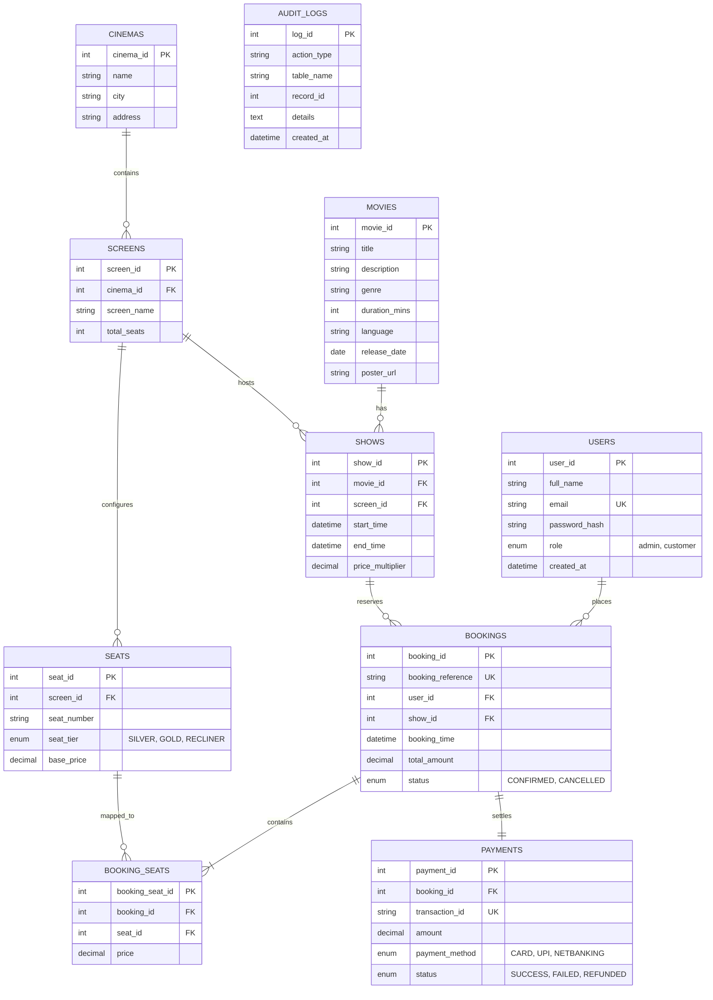

# 🎬 CinePass - Movie Ticket Booking System (DBMS Mini Project)

A full-stack, enterprise-grade Movie Ticket Booking System built with **MySQL 8.0**, **Python (Flask)**, and modern **HTML5/CSS3/JavaScript**. Designed specifically to fulfill and exceed college DBMS requirements with **Third Normal Form (3NF)** normalization, **ACID transactions**, **Stored Procedures**, **Triggers**, **Views**, and **Concurrency Control (Row-level Locking)**.

---

## 🌟 Key Features

### 👤 Customer Experience
* **Authentication**: Secure sign-up, sign-in, and session management with salted `werkzeug.security` password hashing.
* **Browse & Search**: Real-time catalog filtering by title and genre.
* **Multiplex Scheduling**: Browse showtimes across multiple cinemas (e.g., PVR Heritage, INOX Megaplex) and screens (Dolby Atmos, IMAX).
* **Interactive Visual Seat Matrix**:
  * Tier-based seating: **Silver** ($150), **Gold** ($250), and **Recliner** ($400).
  * Real-time seat statuses: Available, Selected, and Booked.
  * Live price calculation with peak-hour multiplier support.
* **Simulated Checkout**: Choice of UPI/QR Code, Credit/Debit Cards, or Net Banking.
* **Digital Perforated Ticket Pass**: Boarding-pass design with printable receipt and simulated scanner barcode/QR code.
* **Booking Management**: View past orders and 1-click booking cancellation with automated refund processing.

### 🛡️ Administrator Panel
* **Live System Metrics**: Total active movies, upcoming shows, confirmed reservations, and gross sales revenue.
* **Multiplex Revenue Analytics**: Aggregated real-time financial reporting powered by SQL View `vw_cinema_revenue`.
* **Movie Catalog CRUD**: Add new releases with posters, ratings, duration, and genres; cascade-delete movies.
* **Show Scheduler**: Assign movies to specific cinema screens with custom start/end times and price multipliers.
* **Trigger-Powered Audit Logs**: Dedicated inspector watching events in the `audit_logs` table.

### 🎓 Advanced DBMS Implementation
* **3NF Normalization**: Complete elimination of insertion, deletion, and update anomalies across 10 tables.
* **Row-Level Locking & Concurrency Control**: Prevents double-booking via `SELECT ... FOR UPDATE` inside atomic transactions.
* **Stored Procedures**:
  * `sp_get_show_seats(p_show_id)`: Fetches complete seat grid with live reservation flags.
  * `sp_cancel_booking(p_id, p_uid)`: Performs secure, authenticated cancellation.
* **SQL Views**:
  * `vw_active_shows`: Multiplex show aggregation with remaining seats counter.
  * `vw_booking_details`: Multi-table join for digital tickets and receipts.
  * `vw_cinema_revenue`: Aggregation report of ticket sales and revenue.
* **Database Triggers**:
  * `trg_after_booking_insert`: Auto-records every confirmed booking into `audit_logs`.
  * `trg_after_booking_update`: Auto-updates payment status to `REFUNDED` and audits cancellation upon booking status update.

---

## 🏗️ Relational Schema (3NF)



---

## 🚀 Quick Start Guide

### 1. Database Configuration
Make sure your MySQL server is running (Service `MySQL80` on port `3306`).
Configuration is saved in `.env`:
```ini
DB_HOST=localhost
DB_PORT=3306
DB_USER=root
DB_PASSWORD=ary984@ArY
DB_NAME=movie_booking_db
SECRET_KEY=college_dbms_movie_ticket_secret_key_2026
```

To re-seed or initialize the database from scratch at any time:
```powershell
python database/init_db.py
```

### 2. Start the Application
Run the Flask server:
```powershell
python run.py
```
Open your browser and navigate to: **`http://127.0.0.1:5000`**

---

## 🔑 Demo Credentials

| Role | Email | Password | Access Details |
| :--- | :--- | :--- | :--- |
| **Administrator** | `admin@cinema.com` | `Admin@123` | Full access to Admin Panel, CRUD, Revenue & Audits |
| **Customer** | `john@example.com` | `User@123` | Ticket booking, Seat matrix, My Bookings, Cancellation |

*(The login screen also features 1-click demo filler buttons for fast demonstration).*

---

## 🧪 Testing & Verification

Run the automated integration test to verify the complete ACID booking flow, trigger firing, and cancellation:
```powershell
python test_integration.py
```

---

## 🎯 Viva Q&A Quick Reference

1. **Q: Why is this schema in 3NF?**
   * *A:* 1NF is achieved by storing atomic values (seats split into junction table `booking_seats`). 2NF is met because there are no partial dependencies on composite keys. 3NF is satisfied because transitive dependencies are eliminated (e.g. Cinema address is stored strictly in `cinemas`, not duplicated across `shows` or `bookings`).
2. **Q: How is Double-Booking prevented?**
   * *A:* Through transaction isolation and row-level locking: when a user initiates a booking, a transaction locks the seat records using `SELECT ... FOR UPDATE`. If a concurrent transaction requests the same seat, it is blocked or encounters a conflict, triggering a safe `ROLLBACK`.
3. **Q: How are Triggers used in this project?**
   * *A:* `trg_after_booking_insert` automatically writes booking references and totals to `audit_logs`. `trg_after_booking_update` fires upon status changes to `CANCELLED`, automatically modifying the linked `payments` record to `REFUNDED` and logging the event without requiring manual application-level queries.
